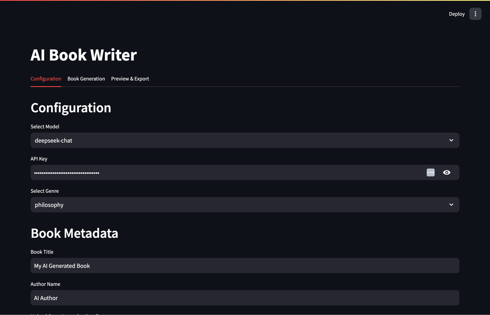

# AutoGen Book Generator

## Overview
The AutoGen Book Generator is an advanced AI-powered system that creates complete, structured books through collaborative AI agents. Designed for authors, educators, and content creators, it streamlines the book creation process while maintaining high-quality output.


## Key Features
- Multi-agent collaborative writing system
- Automated chapter generation with consistent formatting
- Intelligent world-building and setting management
- Context-aware character development
- Built-in validation and error handling
- Customizable templates for various genres

## Use Cases
1. **Fiction Writing**: Generate novels, short stories, and series
2. **Educational Content**: Create textbooks and study guides
3. **Technical Documentation**: Produce comprehensive manuals
4. **Content Marketing**: Develop ebooks and whitepapers
5. **Personal Projects**: Write memoirs, journals, or creative works

## Getting Started

### Installation
1. Clone the repository:
```bash
git clone https://github.com/yourusername/autogen-book-generator.git
cd autogen-book-generator
```

2. Create a virtual environment:
```bash
python -m venv venv
source venv/bin/activate  # On Windows: venv\Scripts\activate
```

3. Install dependencies:
```bash
pip install -r requirements.txt
```

### Basic Usage
1. Start the generator using the quickstart script:
```bash
./quickstart.sh
```

2. The program will:
- List all available genres
- Prompt you to select a genre
- Display the selected configuration:
```bash
=== Book Generation Configuration ===
Selected Genre: [Your Selected Genre]
LLM Model: [Selected Model]
```

3. Follow the prompts to configure your book:
- Provide initial concepts or themes
- Set chapter count and length
- Press Enter to start generation

## Exporting Genres

The system supports exporting books in different genres using the BOOK_GENRE environment variable. Here's how to use it:

1. Set the BOOK_GENRE environment variable before running the generator:
```bash
export BOOK_GENRE=literary_fiction
python main.py
```

2. Available genre templates:
- fantasy_scifi
- historical_fiction
- literary_fiction
- romance
- thriller_mystery
- young_adult

3. To list all available genres:
```bash
ls config_templates/genre/ | sed 's/.py//g'
```

4. The system will automatically load the appropriate genre configuration and apply it to the book generation process.

5. You can verify the active genre in the startup output:
```bash
=== Book Generation Configuration ===

Selected Genre: literary_fiction
Writing Style: Standard
Narrative Style: Third Person
```

## Architecture
The system uses multiple specialized agents:
- **Story Planner**: Creates high-level story arcs
- **World Builder**: Establishes consistent settings
- **Memory Keeper**: Tracks continuity and context
- **Writer**: Generates the actual prosea
- **Editor**: Reviews and improves content
- **Outline Creator**: Creates detailed chapter outlines

## Configuration
Customize the system through `config.py`:
- Set output directory
- Configure LLM parameters
- Adjust generation settings
- Enable/disable features

### Genre Configuration
The system includes pre-configured genre templates located in `config_templates/genre/`. 

#### Listing Available Genres
To see all available genre templates:
1. Navigate to the genre templates directory:
```bash
cd config_templates/genre/
```
2. List the files:
```bash
ls
```

#### Exporting Genre Configuration
To export a genre configuration for use:
1. Open `config.py`
2. Set the `genre_template` parameter to the desired genre file:
```python
genre_template = "config_templates/genre/fantasy_scifi.py"
```
3. The system will automatically export this configuration when you run:
```bash
python main.py
```

#### Switching Between Genres
To change genres:
1. Open `config.py`
2. Update the `genre_template` path to point to your desired genre
3. Save the file
4. Restart the application:
```bash
python main.py
```

#### Verifying Active Genre
When you start the application, the console will display:
```bash
=== Book Generation Configuration ===

Selected Genre: [Genre Name]
Writing Style: [Style]
Narrative Style: [Narrative Style]
```

Available genre templates:
- fantasy_scifi.py
- historical_fiction.py
- literary_fiction.py
- romance.py
- thriller_mystery.py
- young_adult.py

### Troubleshooting Genre Configuration
If the genre isn't being recognized:
1. Ensure the path in `genre_template` is correct and points to an existing file
2. Verify the file has proper Python syntax and configuration
3. Check for any errors in the console output
4. Make sure you're running the latest version of the code

To create a custom genre template:
1. Copy an existing template from `config_templates/genre/`
2. Modify the template parameters
3. Save it with a new name in the same directory
4. Update `config.py` to point to your new template

## Development
To contribute:
1. Fork the repository
2. Create a feature branch
3. Install dev dependencies:
```bash
pip install -r requirements.txt
```
4. Make your changes
5. Run tests:
```bash
pytest
```
6. Submit a pull request

## Testing
The project includes:
- Unit tests
- Integration tests
- Monitoring tests
- Code coverage reporting

Run tests with:
```bash
pytest tests/ --cov=./ --cov-report=html
```

## License
MIT License - See LICENSE for details

## Acknowledgments
- Built using Microsoft's AutoGen framework
- Inspired by collaborative writing systems
